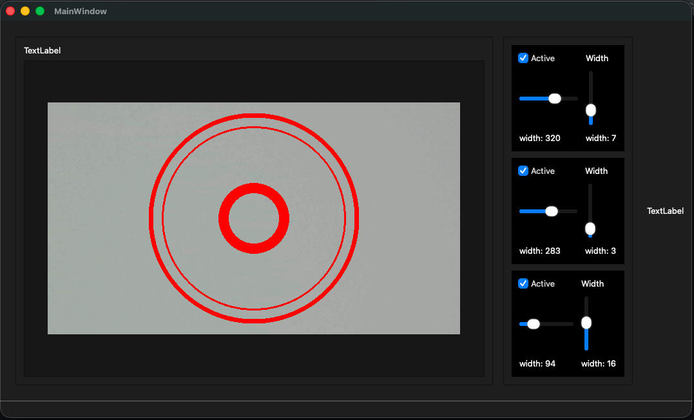

# QCollimator

I thought I would try and write a simple Collumator tool so I can use a cheap SV205 Web-Cam type camera to check the colimination on my GSO 6".

The Collumation screen looks something like this 



## What do you require ??

Some form of Web Camera that is compatible with Qt/your computer should be enough. As I only have 1 web camera (An SV205 so not a true astro camera - a Web YUYV type camera), I pick the **default** camera automatically in the code. 

Please note: **For Mac users** - there is some extra security that needs to be granted (using the Code. It ONLY allows access to the Web Camera for this session - and does not allow access to Microphone). You can vertify this using the **Info.plist**. 

## Hardware 

  - A Web Camera connected to your Computer
  
## Software

  - Qt 6 Compiler 
  - cmake needs to be installed 

Build now checked for 

  - Linux (Arch)
  - Mac 

# Build Process

Quite simple (I think) 

Get the code 

     cd <Your Development Area> 
     git clone git@github.com:timseed/QCollimate.git
     cd QCollimate 
     mkdir build
     cd build
     cmake ..
     make
     make run
     
You should see the initial screen like this 


You need to make the Ring's **active** in order to see them. You can Dynamically re-size them to match your eyepiece data.

## Errors/Warnings 

None.

This is my make output

```text
[  0%] Built target QCollimate_autogen_timestamp_deps
[ 11%] Automatic MOC and UIC for target QCollimate
[ 11%] Built target QCollimate_autogen
[ 22%] Building CXX object CMakeFiles/QCollimate.dir/QCollimate_autogen/mocs_compilation.cpp.o
[ 33%] Building CXX object CMakeFiles/QCollimate.dir/main.cpp.o
[ 44%] Building CXX object CMakeFiles/QCollimate.dir/mainwindow.cpp.o
[ 55%] Building CXX object CMakeFiles/QCollimate.dir/Widgets/ringwidget.cpp.o
[ 66%] Building CXX object CMakeFiles/QCollimate.dir/Widgets/colview.cpp.o
[ 77%] Building CXX object CMakeFiles/QCollimate.dir/Widgets/gridlayoutdebugger.cpp.o
[ 88%] Linking CXX executable QCollimate.app/Contents/MacOS/QCollimate
[100%] Built target QCollimate
```

# QT Code

Qt was easy initially to get a Video feed,the trouble was I could not manipulate an overlay. This took quite a long time to understand.


# Mac-isms

On a mac to see the available USB camera you type

     system_profiler SPCameraDataType

Which in my case yields

```text
Camera:

    SVBONY SV205:

      Model ID: UVC Camera VendorID_3034 ProductID_22656
      Unique ID: 0x1124300bda5880
```

Due to **Security** the Mac needs to be granted permission in 2 places - Info.plist ( So I have this file as a source file,and referenced in the CMakelists.txt), but it also needs the user to confirm they are allowing the camera to be used. 

Now this is a little more tricky, as it needs to be done in a careful manner. i.e. Do not connect to the camera until we have permission.... 

So the code goes

  - setupUi(this);
  - CameraPermission();
    - This just keeps checking until 1 of 2 possibilties
      - Granted - we then call the Widget creation and connection code
      - Denied - we give the user a message and throw our toys out of the pram. 
      
If you get a message looking like 

```text
QCollimate starting
qt.multimedia.ffmpeg: Using Qt multimedia with FFmpeg version 7.1.2 LGPL version 2.1 or later
Trying to use  ""
```

No suitable video Camera can be found on your system.


# Why did I create this ?

It is cloudy and raining.... I am waiting for my new GSO 6" Astro - which will need to be (occasionally??) collumated. This seemed a good use of my time and resources. 

*Plus* ... trying to access Streaming Video via QT has eluded me for some time. 


## Next Steps

Use with my scope (when it arrives !)

There already is the provision for different colours for the rings already. It will not be difficult to implement - but only of use under special circumstances I think.

## Problems/Feedback 

Please let me know... 

